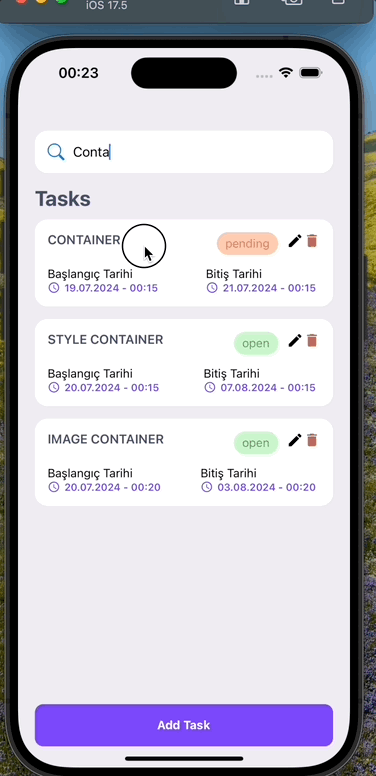

<h1>TaskApp</h1>

Bu proje, kullanıcıların görevlerini kolayca yönetmelerini sağlayan bir React Native uygulamasıdır. Görev ekleme, güncelleme, silme ve durum belirleme gibi temel özellikleri içerir.

<h2>Kullanılan Teknolojiler</h2>

- **@react-navigation/native**: Navigasyon için
- **@react-navigation/stack**: Yığın tabanlı navigasyon için
- **axios**: HTTP istekleri için
- **react**: Ana kütüphane
- **react-native**: Mobil geliştirme için
- **react-native-gesture-handler**: Jest işlemleri için
- **react-native-safe-area-context**: Güvenli alan yönetimi için
- **react-native-screens**: Ekran optimizasyonu için

<h2>Özellikler</h2>

- 📱 **Kullanıcı Dostu Arayüz**: Basit ve sezgisel tasarım
- ➕ **Görev Ekleme**: Yeni görevler oluşturma
- ✏️ **Görev Güncelleme**: Mevcut görevleri düzenleme
- 🗑️ **Görev Silme**: Görevleri kaldırma
- 🗓️ **Tarih Seçici**: Başlangıç ve bitiş tarihleri belirleme
- 🔄 **Durum Belirleme**: Görev durumu yönetimi
- 🌈 **Animasyonlar**: Akıcı ve etkileşimli animasyonlar

<h2>Ekran Görüntüleri</h2>

